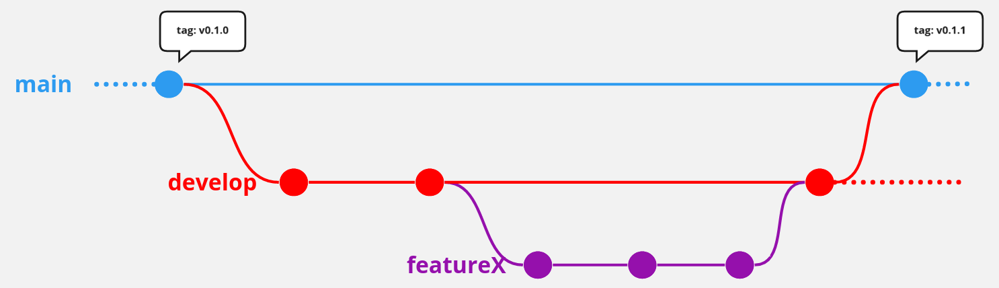

### Develop Strategy
Github CI is utilized for Continuous Integration/Deployment and requires a specific branching strategy to be followed. All final release source can be found on the ```main``` branch. Any pull request into the ```main``` branch will have compilation and unit tests ran against it. When a PR into ```main``` completes, a "release" will be made where the final artifacts are published to Github and a new tag is created. Any ongoing developer changes should be made on a feature branch created from the ```develop``` branch. PRs are then made from the feature branch back into the ```develop``` branch where the source will be tested and compiled before completion. When the developer has completed several features and is ready to create a release, a PR from ```develop``` into ```main``` is created.

